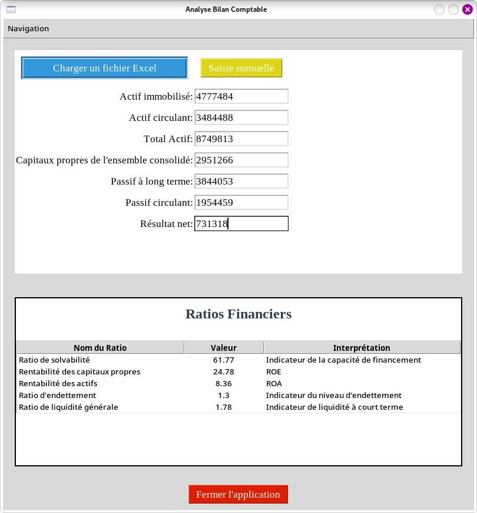
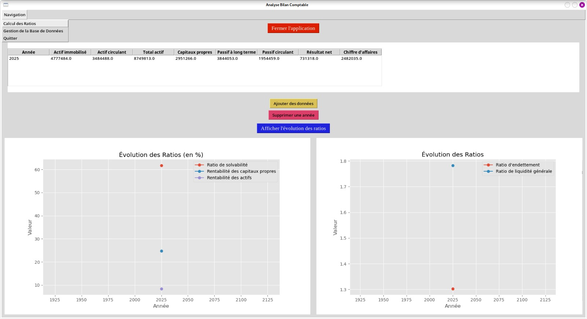

## financial-analysis
This application extracts data from an Excel file, calculates financial ratios, communicates with a postgresql database and plots ratio trends over the years based on the saved data.

## Structure
- The excel __bilan_resultat.xlsx__ contains two pages. The first contains a balance sheet data and the second, the income statement data.
- The file __finance_app.py__ is the main module to execute.
- The notebook __finance.ipynb__ shows the data extraction process.

## Before test
- Ensure you have postgresql install in your machine.
[Follow this link for installation and configuration](https://www.w3schools.com/postgresql/postgresql_install.php)
- Ensure you have the following libraries installed:
    - __pandas__ (for data processing)
    - __psycopg2__ (for database management)
    - __matplotlib__ (for data plotting)
    - __tkinter__ (for graphical interface)
- In the file __finance_app.py__, update the database connexion info in the function _connect_db()_:
```python
conn = psycopg2.connect(
    dbname="database_name", # ex.:analyse_des_ratios
    user="username", # ex.: postgres
    password="password", 
    host="localhost",
    port="port" # ex.: 5432
)
```
- Ensure that you have created the database with the correct name mention above

## What you will see


